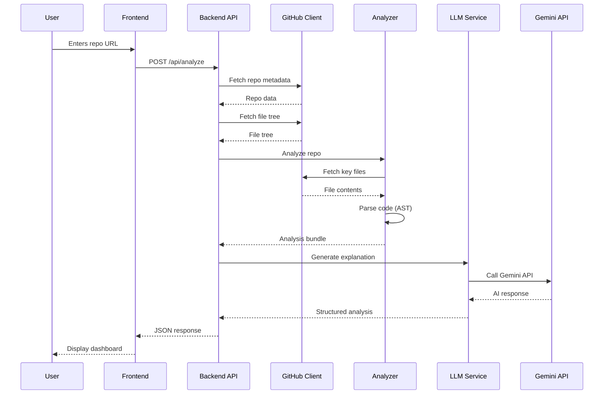

# Comprehensive Contributor Onboarding Guide

## Overview

This document outlines a complete system for helping new open-source contributors understand entire repositories and codebases before contributing. It describes the architecture, implementation approach, and actionable sections that make the FirstPR tool a powerful onboarding assistant.

## Two-Step LLM Pipeline Architecture

### STEP 1 — Data Collection & Preparation

**Objective**: Gather and preprocess repository data efficiently while respecting token limits.

#### 1.1 File Prioritization Strategy

Files are fetched and processed in priority order:

```
Priority 1 (Always Include):
- README.md, README.rst, README.txt
- CONTRIBUTING.md, CONTRIBUTING.rst
- LICENSE, LICENSE.md
- CODE_OF_CONDUCT.md

Priority 2 (High Value Documentation):
- docs/ directory (all markdown files)
- CHANGELOG.md, HISTORY.md, RELEASES.md
- ARCHITECTURE.md, DESIGN.md
- API.md, API_REFERENCE.md

Priority 3 (Configuration & Setup):
- package.json, pyproject.toml, Cargo.toml, go.mod
- requirements.txt, Pipfile, poetry.lock
- .github/workflows/*.yml (CI/CD configs)
- docker-compose.yml, Dockerfile
- Makefile, justfile

Priority 4 (Entry Points):
- main.py, app.py, __main__.py, wsgi.py
- index.js, server.js, app.js, main.js
- src/index.tsx, src/main.ts, src/App.tsx
- cmd/main.go, main.go

Priority 5 (Key Source Code):
- Top-level source files in src/, lib/, pkg/
- Core modules identified by import frequency
- Test files in tests/, __tests__, *_test.py, *.test.js
```

#### 1.2 Chunking Rules

**Text Chunking Strategy**:
```python
MAX_CHUNK_SIZE = 4000  # characters
CHUNK_OVERLAP = 400    # characters for context continuity

def chunk_file(content: str, path: str) -> list[dict]:
    """
    Chunks a file with metadata preservation.
    
    Returns list of chunks with:
    - content: The text content
    - path: File path
    - chunk_id: Sequential identifier
    - line_range: [start_line, end_line]
    - heading: Section heading if markdown
    """
    chunks = []
    
    # For markdown files, chunk by headers
    if path.endswith('.md'):
        chunks = chunk_by_markdown_headers(content, path)
    
    # For code files, chunk by logical units
    elif is_code_file(path):
        chunks = chunk_by_code_structure(content, path)
    
    # For other files, use sliding window
    else:
        chunks = chunk_by_sliding_window(content, path)
    
    return chunks
```

**Code-Aware Chunking**:
- Python: Chunk by class and function boundaries
- JavaScript/TypeScript: Chunk by function/class/export blocks
- Preserve complete logical units (don't split mid-function)

**Markdown Chunking**:
- Split on H1, H2, H3 headers
- Preserve header hierarchy in metadata
- Keep code blocks intact within chunks

#### 1.3 Token Budgeting Strategy

```python
TOKEN_LIMITS = {
    "total_context": 1_000_000,      # Gemini 3 Pro context window
    "reserved_for_response": 8_000,   # Output tokens
    "system_prompt": 2_000,           # Instruction overhead
    "available_for_chunks": 990_000   # Actual data budget
}

# Approximation: 1 token ≈ 4 characters
def estimate_tokens(text: str) -> int:
    return len(text) // 4

def budget_chunks(chunks: list[dict]) -> list[dict]:
    """
    Select chunks that fit within token budget using priority system.
    """
    selected = []
    token_count = 0
    max_tokens = TOKEN_LIMITS["available_for_chunks"]
    
    # Sort chunks by priority score
    prioritized = prioritize_chunks(chunks)
    
    for chunk in prioritized:
        chunk_tokens = estimate_tokens(chunk["content"])
        if token_count + chunk_tokens <= max_tokens:
            selected.append(chunk)
            token_count += chunk_tokens
        else:
            # Summarize instead of including verbatim
            summary = create_chunk_summary(chunk)
            summary_tokens = estimate_tokens(summary["content"])
            if token_count + summary_tokens <= max_tokens:
                selected.append(summary)
                token_count += summary_tokens
    
    return selected

def prioritize_chunks(chunks: list[dict]) -> list[dict]:
    """
    Score and sort chunks by importance.
    """
    def score_chunk(chunk: dict) -> float:
        score = 0.0
        path = chunk["path"]
        
        # File type scoring
        if "README" in path.upper():
            score += 100
        elif path.startswith("docs/"):
            score += 80
        elif "CONTRIBUTING" in path.upper():
            score += 90
        elif path.endswith((".py", ".js", ".ts", ".tsx")):
            score += 50
        elif path.endswith(".md"):
            score += 60
        
        # Entry point bonus
        if is_entry_point(path):
            score += 40
        
        # Core module bonus (in src/, lib/, pkg/)
        if "/src/" in path or "/lib/" in path:
            score += 30
        
        # Length penalty (prefer concise chunks)
        content_length = len(chunk["content"])
        if content_length < 2000:
            score += 10
        elif content_length > 8000:
            score -= 20
        
        return score
    
    return sorted(chunks, key=score_chunk, reverse=True)
```

#### 1.4 Chunk Summarization

When chunks don't fit in budget:

```python
def create_chunk_summary(chunk: dict) -> dict:
    """
    Create a condensed summary of a chunk using LLM.
    """
    prompt = f"""
    Summarize this code/documentation chunk in 2-3 sentences:
    
    File: {chunk['path']}
    Lines: {chunk['line_range']}
    
    Content:
    {chunk['content'][:1000]}...
    
    Focus on: main purpose, key functions/classes, and how it fits the project.
    """
    
    summary = call_llm_for_summary(prompt)
    
    return {
        "content": summary,
        "path": chunk["path"],
        "chunk_id": chunk["chunk_id"],
        "is_summary": True,
        "original_size": len(chunk["content"])
    }
```

### STEP 2 — Meta-Prompt Generation + Final Explanation

**Objective**: Generate an optimized prompt that produces structured repository explanations.

#### 2.1 Prompt Composer LLM Call

The Prompt Composer decides which chunks to paste verbatim vs. reference in summary form.

**Template for Prompt Composer**:

```python
PROMPT_COMPOSER_TEMPLATE = """
You are a Prompt Engineering Expert. Your task is to create an optimized system + user prompt for explaining a repository to new contributors.

## Available Chunks
You have {chunk_count} chunks of repository data:

{chunk_manifest}

Each chunk has:
- ID: Unique identifier
- Path: File path
- Type: [readme/docs/code/config/test]
- Size: Character count
- Summary: Brief description

## Your Task
Generate a prompt that will be sent to another LLM to produce a comprehensive repository explanation.

Your generated prompt should:
1. Include the MOST IMPORTANT chunks verbatim (especially README, CONTRIBUTING, key entry points)
2. Reference other chunks by summary only
3. Structure information into these sections:
   - Project Snapshot
   - Guided Tour
   - Architecture Map
   - Module/Package View
   - File-Level Explanations
   - Sequence Diagrams
   - Tests & Local Runbook
   - Issues & PR Integration
   - Glossary
   - Learning Path

## Decision Criteria
Include verbatim if:
- README or CONTRIBUTING files (highest priority)
- Entry point files (main.py, index.js, etc.)
- Core architecture files
- Chunk size < 1000 chars
- Contains unique configuration or setup instructions

Summarize if:
- Large code files (>2000 chars)
- Repetitive test files
- Generated files (package-lock.json, etc.)
- Secondary documentation

## Output Format
Return a JSON object:
{{
    "system_prompt": "Instructions for the final LLM...",
    "user_prompt": "Repository data and explanation request...",
    "chunks_verbatim": [list of chunk IDs to include fully],
    "chunks_summarized": [list of chunk IDs to reference by summary]
}}

Ensure the combined prompt stays within 990,000 tokens (~3.96M characters).
"""
```

**Example Invocation**:

```python
async def compose_optimized_prompt(chunks: list[dict]) -> dict:
    """
    Call Prompt Composer LLM to generate optimized prompts.
    """
    # Create chunk manifest
    chunk_manifest = []
    for chunk in chunks:
        manifest_entry = {
            "id": chunk["chunk_id"],
            "path": chunk["path"],
            "type": classify_chunk_type(chunk),
            "size": len(chunk["content"]),
            "summary": chunk.get("summary") or generate_quick_summary(chunk)
        }
        chunk_manifest.append(manifest_entry)
    
    # Format manifest as readable text
    manifest_text = json.dumps(chunk_manifest, indent=2)
    
    # Call Prompt Composer
    composer_prompt = PROMPT_COMPOSER_TEMPLATE.format(
        chunk_count=len(chunks),
        chunk_manifest=manifest_text
    )
    
    response = await call_llm(
        model="gemini-3-pro-preview",
        prompt=composer_prompt,
        temperature=0.3  # Lower temperature for deterministic prompt engineering
    )
    
    # Parse JSON response
    prompt_specification = json.loads(response)
    
    return prompt_specification
```

#### 2.2 Final LLM Call Template

**Template for Final Repository Explanation**:

```python
FINAL_EXPLANATION_TEMPLATE = """
You are an expert technical mentor onboarding a new open-source contributor to the '{repo_name}' repository.

## Your Mission
Create a comprehensive, well-structured guide that helps the contributor:
1. Understand what the project does and why it exists
2. Navigate the codebase confidently
3. Understand the architecture and key components
4. Know where to start contributing
5. Find answers to common questions quickly

## Repository Context

{verbatim_chunks}

## Additional Context (Summaries)

{summarized_chunks}

## Repository Metadata
- Stars: {stars}
- Language: {language}
- Contributors: {contributor_count}
- Open Issues: {issue_count}
- Active PRs: {pr_count}

## Required Output Structure

Generate a detailed guide with these sections:

### 1. Project Snapshot
- One-liner description
- Target audience
- Problem it solves
- Project maturity level
- Key statistics

### 2. Guided Tour
- What the project does (detailed)
- Core user journey
- Example use cases
- Visual representation (if applicable)

### 3. Architecture Map
- High-level architecture narrative
- Major components and their relationships
- Technology stack with reasoning
- Architecture diagram in MermaidJS format
- Data flow explanation

### 4. Module/Package View
- Directory structure with responsibilities
- Key modules and their purposes
- Import/dependency patterns
- Module boundaries

### 5. File-Level Augmented Code Explanations
- Entry points and what they do
- Core files worth reading first
- Configuration files explained
- Where specific functionality lives

### 6. Sequence and Data-Flow Diagrams
- Common user workflows (as Mermaid sequence diagrams)
- Data transformation pipelines
- API request/response flows
- State management patterns

### 7. Tests and Local Runbook
- Setup instructions (step-by-step)
- How to run tests
- How to run locally
- Common development commands
- Debugging tips

### 8. Issues and PR Integration
- Good first issues to tackle
- Issue labels explained
- PR workflow and requirements
- Code review process

### 9. Glossary of Project Terms
- Domain-specific terms
- Technical acronyms
- Framework-specific terminology
- Project-specific naming conventions

### 10. Personalized Learning Path
- Day 0: Setup and first read
- Day 1: Understand core concepts
- Days 2-3: Dive into key modules
- Days 4-7: First contribution
- Week 2+: Advanced contributions

## Output Format
Return a JSON object with these exact keys:
{{
    "project_snapshot": {{ ... }},
    "guided_tour": {{ ... }},
    "architecture_map": {{ ... }},
    "module_package_view": {{ ... }},
    "file_level_explanations": {{ ... }},
    "sequence_diagrams": {{ ... }},
    "tests_and_runbook": {{ ... }},
    "issues_and_prs": {{ ... }},
    "glossary": {{ ... }},
    "learning_path": {{ ... }}
}}

Make it actionable, specific, and welcoming to newcomers.
"""
```

---

## Section Details for Contributors

Each section below provides specific guidance for new contributors navigating the FirstPR project.

### Section 1: Project Snapshot

**What it is**: A quick, high-level overview of the project that answers "What is this?" in 30 seconds.

**Why it matters**: First impressions matter. New contributors need to quickly assess if this project aligns with their interests and skills.

**Where to look**:
- `/README.md` (lines 1-10)
- `/backend/src/main.py` (application entry point)
- `/frontend/src/App.tsx` (UI entry point)

**Quick checks**:
```bash
# Check project description
cat README.md | head -20

# Check tech stack
cat backend/requirements.txt
cat frontend/package.json | jq '.dependencies'

# Count active contributors
git shortlog -s -n | head -10
```

**Starter task (20 minutes)**:
- Read the README completely
- Clone the repo and run `docker-compose up`
- Access the app at `http://localhost:3000`
- Analyze one repository (try `octocat/Hello-World`)
- Note which sections of the analysis you found most useful

### Section 2: Guided Tour

**What it is**: A narrated walkthrough of the codebase, like a museum tour guide explaining exhibits.

**Why it matters**: Helps contributors understand the big picture before diving into details. Reduces feeling overwhelmed.

**Where to look**:
- `/CONTRIBUTOR_ONBOARDING_GUIDE.md` (this file)
- `/backend/src/` directory structure
- `/frontend/src/components/` directory
- `/ARCHITECTURE.md` (if exists)

**Quick checks**:
```bash
# Visualize directory structure
tree -L 3 -I 'node_modules|.venv|__pycache__|.git'

# Find key files by size (often core logic)
find . -name "*.py" -o -name "*.tsx" | xargs wc -l | sort -rn | head -20

# Count lines of code by language
cloc . --exclude-dir=node_modules,.venv,dist,build
```

**Starter task (30 minutes)**:
- Map out the request flow: Frontend → API → LLM → Response
- Trace a single API call (e.g., analyze repository) from RepoInput.tsx to llm.py
- Draw a simple flowchart on paper
- Compare your understanding with `/ARCHITECTURE.md` or create one

### Section 3: Architecture Map

**What it is**: A technical diagram showing how major components connect and communicate.

**Why it matters**: Architecture diagrams prevent contributors from making changes that violate design principles.

**Where to look**:
- `/backend/src/main.py` (FastAPI app initialization)
- `/backend/src/api/routes.py` (API endpoints)
- `/backend/src/services/` (business logic layer)
- `/frontend/src/api/client.ts` (frontend API client)

**Quick checks**:
```bash
# Check API endpoints
grep -r "@app\.(get|post)" backend/src/api/ --color=always

# Inspect service dependencies
grep -r "import.*services" backend/src/ --color=always

# Check frontend API calls
grep -r "fetch\|axios" frontend/src/ --color=always
```

**Starter task (45 minutes)**:
- Create a Mermaid diagram of the architecture:
  ```mermaid
  graph TB
    A[Frontend React App] -->|HTTP POST| B[FastAPI Backend]
    B --> C[GitHub API Client]
    B --> D[LLM Service]
    B --> E[Analyzer Service]
    D --> F[Gemini API]
    C --> G[GitHub API]
  ```
- Identify which services are synchronous vs asynchronous
- Note where data transformations happen

### Section 4: Module/Package View

**What it is**: Detailed breakdown of each module/package's responsibility and exports.

**Why it matters**: Helps contributors quickly find where to make changes without searching the entire codebase.

**Where to look**:
- `/backend/src/services/` (service layer modules)
- `/backend/src/core/` (core utilities and models)
- `/backend/src/api/` (API routes)
- `/frontend/src/components/` (React components)
- `/frontend/src/types/` (TypeScript types)

**Quick checks**:
```bash
# List all Python modules
find backend/src -name "*.py" -type f | sort

# Check module exports
grep -r "^class \|^def \|^async def" backend/src/services/ --color=always

# List React components
ls -1 frontend/src/components/*.tsx

# Check TypeScript types
cat frontend/src/types/index.ts
```

**Starter task (30 minutes)**:
Create a module responsibility matrix:

| Module | Responsibility | Key Exports | Dependencies |
|--------|---------------|-------------|--------------|
| `services/llm.py` | LLM interactions | `GeminiService` | `google.genai` |
| `services/github.py` | GitHub API calls | `GitHubClient` | `httpx` |
| `services/analyzer.py` | Code analysis | `AnalyzerService` | `ast`, `asyncio` |
| ... | ... | ... | ... |

### Section 5: File-Level Augmented Code Explanations

**What it is**: Detailed explanations of key files with inline commentary about design decisions.

**Why it matters**: Helps contributors understand not just WHAT the code does, but WHY it was written that way.

**Where to look**:
- `/backend/src/services/llm.py` (AI interactions with retry logic)
- `/backend/src/services/analyzer.py` (repository analysis with concurrency)
- `/backend/src/core/network.py` (connection pooling)
- `/frontend/src/components/Dashboard.tsx` (main UI component)

**Quick checks**:
```bash
# View file with line numbers
cat -n backend/src/services/llm.py | head -50

# Find files with TODO/FIXME comments
grep -r "TODO\|FIXME\|HACK" backend/ frontend/ --color=always

# Check docstrings
grep -A 3 '"""' backend/src/services/llm.py
```

**Starter task (60 minutes)**:
- Pick one service file (e.g., `llm.py`)
- Read it completely with AI assistance
- Document:
  - Main purpose
  - Key functions and their parameters
  - Error handling strategy
  - Performance optimizations (e.g., retry logic, caching)
- Add comments to your personal annotated copy

### Section 6: Sequence and Data-Flow Diagrams

**What it is**: Visual representations of how data flows through the system for specific operations.

**Why it matters**: Sequence diagrams make complex interactions understandable at a glance.

**Where to look**:
- `/backend/src/api/routes.py` (endpoint definitions)
- Network tab in browser DevTools (watch API calls)
- `/frontend/src/components/RepoInput.tsx` (initiates analysis)

**Quick checks**:
```bash
# Trace async operations
grep -r "async def\|await" backend/src/services/ --color=always

# Check API request/response models
cat backend/src/core/models.py | grep "class.*BaseModel"
```

**Starter task (45 minutes)**:
Create a sequence diagram for "Analyze Repository" flow:



### Section 7: Tests and Local Runbook

**What it is**: Step-by-step instructions for setting up, testing, and running the project locally.

**Why it matters**: Contributors can't contribute if they can't run the code. Clear setup instructions reduce friction.

**Where to look**:
- `/README.md` (setup instructions)
- `/DOCKER.md` (Docker setup)
- `/backend/tests/` (test suite)
- `/frontend/package.json` (npm scripts)
- `/backend/requirements.txt` (Python dependencies)

**Quick checks**:
```bash
# Backend tests
cd backend
python -m pytest tests/ -v

# Frontend tests (if any)
cd frontend
npm test

# Linting
cd backend && python -m ruff check .
cd frontend && npm run lint

# Build checks
cd frontend && npm run build
```

**Starter task (45 minutes)**:
1. Follow setup instructions from README
2. Run the application locally (not Docker)
3. Make a small change (e.g., change a button color)
4. Verify the change works
5. Document any issues you encountered and solutions

### Section 8: Issues and PR Integration

**What it is**: Information about open issues, good first issues, and how to contribute via PRs.

**Why it matters**: Helps contributors find appropriate tasks and understand the contribution workflow.

**Where to look**:
- GitHub Issues page: https://github.com/adarshvision1/FirstPR/issues
- `/CONTRIBUTING.md` (if exists)
- `.github/PULL_REQUEST_TEMPLATE.md` (if exists)
- Labels on issues (e.g., "good first issue", "help wanted")

**Quick checks**:
```bash
# Check if CONTRIBUTING guide exists
cat CONTRIBUTING.md

# List recent commits
git log --oneline -20

# Check branch naming conventions
git branch -a | head -10

# View PR template
cat .github/PULL_REQUEST_TEMPLATE.md
```

**Starter task (30 minutes)**:
- Browse open issues on GitHub
- Find 3 issues you might be able to tackle
- For each issue:
  - Note the difficulty level
  - Identify which files you'd need to modify
  - Estimate time required
- Comment on one issue introducing yourself

### Section 9: Glossary of Project Terms

**What it is**: Definitions of domain-specific terminology and acronyms used in the codebase.

**Why it matters**: Prevents confusion from jargon and establishes shared vocabulary.

**Where to look**:
- Comments in code files
- Documentation in `/docs`
- README.md
- Variable and function names

**Quick checks**:
```bash
# Find common technical terms
grep -roh "\b[A-Z]{2,}\b" backend/ frontend/ | sort -u

# Extract class and function names
grep -roh "class [A-Za-z_]*\|def [a-z_]*" backend/src/ | sort -u
```

**Starter task (30 minutes)**:
Create a glossary of key terms:

| Term | Definition | Example/Context |
|------|-----------|-----------------|
| LLM | Large Language Model | Gemini 3 Pro used for code analysis |
| AST | Abstract Syntax Tree | Used to parse Python code in analyzer.py |
| PR | Pull Request | How contributors submit changes |
| CI/CD | Continuous Integration/Deployment | Automated testing and deployment |
| Mermaid | Diagram syntax | Used for architecture diagrams |
| FastAPI | Python web framework | Backend framework choice |

### Section 10: Personalized Learning Path

**What it is**: A structured, time-based curriculum for ramping up from beginner to confident contributor.

**Why it matters**: Provides clear milestones and prevents contributors from feeling lost or overwhelmed.

**Where to look**:
- This entire document
- Project documentation
- Code comments
- Test files for examples

**Day 0 (2 hours): Setup and First Read**
- [ ] Clone the repository
- [ ] Read README.md completely
- [ ] Run Docker setup: `docker-compose up`
- [ ] Access the app and test basic functionality
- [ ] Read this CONTRIBUTOR_ONBOARDING_GUIDE.md

**Day 1 (3 hours): Understand Core Concepts**
- [ ] Read `/backend/src/core/models.py` to understand data structures
- [ ] Trace one API request from frontend to backend
- [ ] Review `/backend/src/services/llm.py` to understand AI integration
- [ ] Try running backend tests: `pytest backend/tests/`

**Days 2-3 (4-6 hours): Dive into Key Modules**
- [ ] Study `/backend/src/services/analyzer.py` in detail
- [ ] Understand GitHub API integration in `/backend/src/services/github.py`
- [ ] Review frontend components in `/frontend/src/components/`
- [ ] Make a trivial change (e.g., update a string) and verify it works
- [ ] Read through open issues and identify 2-3 you could tackle

**Days 4-7 (6-10 hours): First Contribution**
- [ ] Pick a "good first issue" or small bug
- [ ] Create a branch: `git checkout -b fix/issue-description`
- [ ] Implement the fix with tests
- [ ] Run full test suite
- [ ] Submit a PR with clear description
- [ ] Respond to code review feedback

**Week 2+ (Ongoing): Advanced Contributions**
- [ ] Take on medium-complexity issues
- [ ] Propose new features in discussions
- [ ] Review other contributors' PRs
- [ ] Help answer questions in issues
- [ ] Contribute to documentation improvements

**Starter task (15 minutes)**:
- Copy this learning path to your personal notes
- Check off completed items
- Set calendar reminders for each day
- Join project communication channels (if any)

---

## Implementation Notes for FirstPR

### Current Architecture

FirstPR already implements a sophisticated repository analysis system with:
- **Backend**: FastAPI with async/await patterns
- **LLM Integration**: Gemini 3 Pro with retry logic and rate limiting
- **GitHub API Client**: Connection pooling, caching, error handling
- **Frontend**: React + TypeScript with Vite build system
- **Performance**: Concurrent file processing, code splitting, optimized network calls

### Enhancements Needed

To fully support the two-step LLM pipeline described above, implement:

1. **Chunking Service** (`backend/src/services/chunking.py`)
   - Implement smart code-aware chunking
   - Add markdown header-based chunking
   - Create token estimation utilities

2. **Prompt Composer Service** (`backend/src/services/prompt_composer.py`)
   - Implement meta-prompt generation
   - Add chunk prioritization logic
   - Create prompt optimization strategies

3. **Enhanced LLM Service** (extend `backend/src/services/llm.py`)
   - Add two-step pipeline support
   - Implement chunk summarization
   - Add structured output parsing

4. **API Endpoints** (extend `backend/src/api/routes.py`)
   - Add `/api/explain-comprehensive` endpoint
   - Support streaming responses for large analyses
   - Add caching layer for repeated analyses

### Token Budgeting in Practice

For Gemini 3 Pro (1M token context):
- Reserve 8K tokens for response
- Reserve 2K tokens for system prompt
- Use remaining ~990K tokens for chunks
- Implement dynamic summarization when approaching limits

### Selection Heuristics Implementation

```python
FILE_PRIORITY_SCORES = {
    "README.md": 100,
    "CONTRIBUTING.md": 90,
    "docs/**/*.md": 80,
    "**/main.py": 75,
    "**/app.py": 75,
    "**/index.js": 75,
    "**/__init__.py": 60,
    "**/package.json": 70,
    "**/*.test.py": 50,
    "**/Dockerfile": 65,
}
```

### Caching Strategy

- Cache chunk computations per commit SHA
- Cache prompt compositions for 1 hour
- Cache final analyses for 24 hours
- Invalidate on repository push events

---

## Best Practices for Contributors

### Code Style
- **Python**: Follow PEP 8, use type hints, async/await patterns
- **TypeScript**: Use strict mode, prefer functional components, proper typing
- **Documentation**: Clear docstrings, inline comments for complex logic

### Testing
- Write tests for new features
- Maintain >80% code coverage
- Test error paths and edge cases

### Performance
- Use async/await for I/O operations
- Batch API calls when possible
- Implement caching for expensive operations
- Profile before optimizing

### Security
- Never commit API keys
- Validate all user inputs
- Sanitize HTML (use DOMPurify)
- Follow OWASP guidelines

---

## Conclusion

This guide provides a comprehensive framework for onboarding new contributors to the FirstPR project (or any repository analyzed by FirstPR). By following the two-step LLM pipeline approach and implementing the described sections, FirstPR becomes a powerful tool for democratizing open-source contribution.

The key to success is **progressive disclosure**: start with high-level snapshots, then provide guided tours, then deep technical details, always with clear action items and learning paths.

**Next Steps**:
1. Implement the chunking service
2. Build the prompt composer
3. Enhance the LLM service with two-step pipeline
4. Add comprehensive endpoint to API
5. Update frontend to display new sections
6. Test with diverse repositories
7. Gather feedback from new contributors

Welcome to the FirstPR community! 🚀
